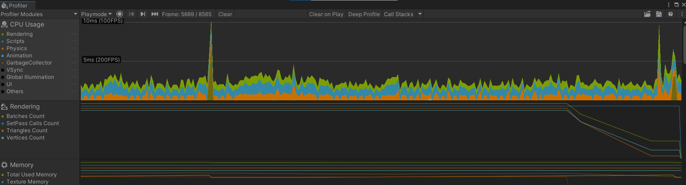
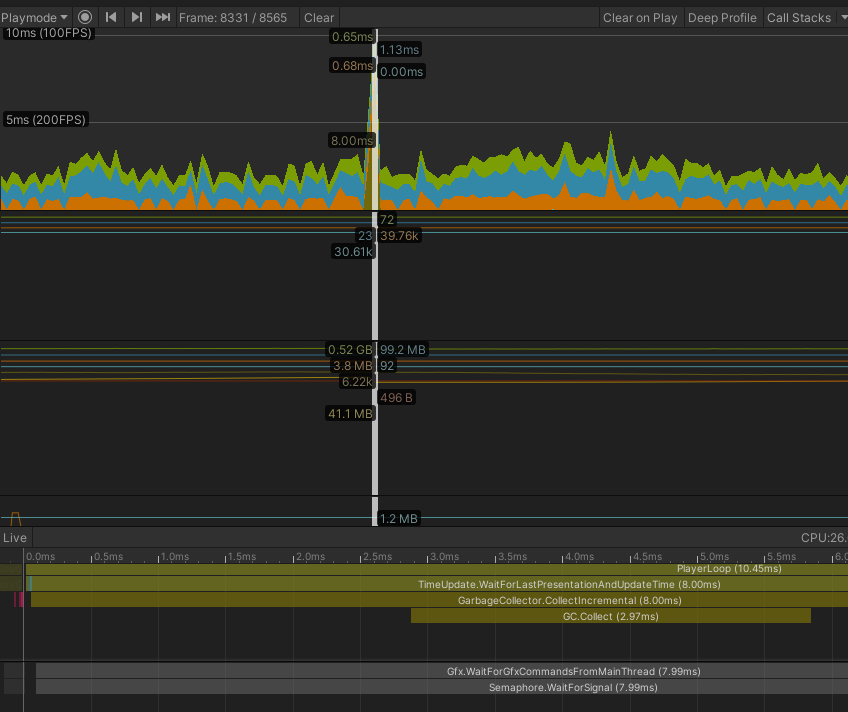
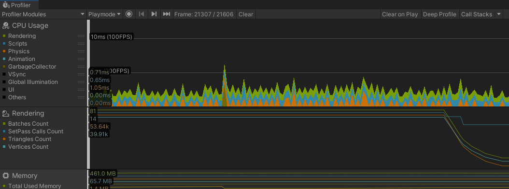
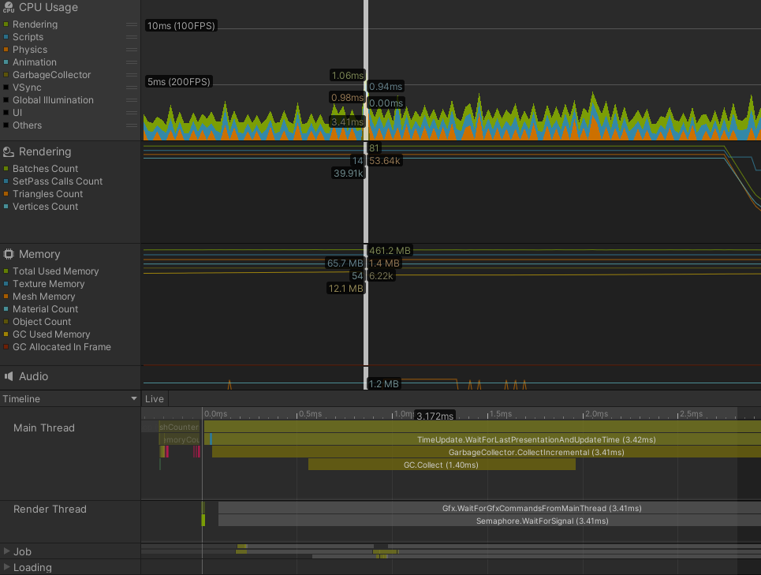

# [Object Pooling]

오브젝트의 생성과 파괴는 무거운 작업이다.  

특히 파괴된 오브젝트가 많을 경우  

Garbage Collection으로 인한 프레임 드랍은 치명적이다.  

따라서 이를 방지하기 위해 오브젝트 풀링이라는 방법을 사용한다.  

## [Object Pooling 구현]

1. 오브젝트를 보관할 오브젝트 풀을 만든다.
1. 오브젝트가 필요하면 오브젝트 풀에서 꺼내서 사용한다.
    * 오브젝트 생성은 풀에 오브젝트가 없지만 필요한 경우에 진행한다.
1. 오브젝트 사용이 끝나면 바로 파괴하지 않고 오브젝트 풀로 반납한다.
    * 오브젝트 파괴는 해당 오브젝트가 완전히 필요 없어지게 되면 그 때 파괴한다.  
      
<br>
이렇게 오브젝트를 재활용하여 생성과 파괴를 최소화 한다.

---  

1. 오브젝트를 보관할 오브젝트 풀을 만든다.
```C#
    //ObjectPool.cs

    public static ObjectPool Instance;

    private Queue<Bullet> poolingObjectQueue = new Queue<Bullet>();
    private GameObject poolingObjectPrefab;

    private void Initialize(int count) //이미 만들어진 오브젝트를 풀링할때 사용하는 함수
    {
        for(int i=0; i<count; i++)
        {
            poolingObjectQueue.Enqueue(CreateNewObject());
        }
    }

    private void Awake()
    {
        Instance = this;
        Initialize(10);
    }
```
* Bullet의 인스턴스들을 큐를 이용하여 관리하도록 한다.
* ObjectPool의 인스턴스를 Instance 라는 static 변수로 선언하여 이용한다.

2. 오브젝트가 필요하면 오브젝트 풀에서 꺼내서 사용한다.
    * 오브젝트 생성은 풀에 오브젝트가 없지만 필요한 경우에 진행한다.
```C#
    //ObjectPool.cs

    public static Bullet GetObject()
    {
        if(Instance.poolingObjectQueue.Count>0) //빌려줄 오브젝트가 있을 때
        {
            var obj = Instance.poolingObjectQueue.Dequeue();
            obj.transform.SetParent(null);
            obj.gameObject.SetActive(true);
            return obj;
        }
        else
        {
            var newObj = Instance.CreateNewObject(); //빌려줄 오브젝트가 없을때 : 새 오브젝트 생성
            newObj.transform.SetParent(null);
            newObj.gameObject.SetActive(true);
            return newObj;
        }
    }

    private Bullet CreateNewObject() //오브젝트를 새로 만들 때 사용하는 함수
    {
        var newObj = Instantiate(poolingObjectPrefab, gameObject.transform).GetComponent<Bullet>();
        newObj.gameObject.SetActive(false);
        return newObj;
    }
```
* 여기서 Instance는 ObjectPool의 인스턴스인 static 변수이다.
* 다른 스크립트에서 Bullet의 인스턴스를 생성하고 싶은 경우 해당 static 함수를 호출하도록 한다.


3. 오브젝트 사용이 끝나면 바로 파괴하지 않고 오브젝트 풀로 반납한다.

```C#
    //ObjectPool.cs
    public static void ReturnObject(Bullet bullet)
    {
        bullet.gameObject.SetActive(false);
        bullet.transform.SetParent(Instance.transform);
        Instance.poolingObjectQueue.Enqueue(bullet);
    }
```
* static 함수 이기 때문에 transform이 아닌 Instance.transform을 인자로 전달한다.  
  여기서 Instance는 ObjectPool의 인스턴스인 static 변수이다.
* 다른 스크립트에서 Bullet의 인스턴스를 제거하고 싶은 경우 해당 statid함수를 호출하여 반환하도록 한다.

### [성능 분석]
Window -> Analysis -> Profiler 항목에서 성능분석을 확인할 수 있다.



<br>

오브젝트의 생성과 파괴작업을 진행하면

중간에 프레임이 튀는 부분이 생기는데, GarbageCollector의 영향이 적지 않음을 확인할 수 있다.



<br>

이때 최대로 사용할 수 있는 Bullet의 인스턴스까지 생성한 후  
오브젝트 풀링을 이용하여 Bullet의 인스턴스를 관리하면 GarbageCollector 부분에 유의미한 변화를 확인할 수 있다.
* GarbageCollector.CollectIncremental (8.00ms) -> (3.41ms)
* GC.Collect (2.97ms) -> (1.40ms)





### [참고 링크]

* https://www.youtube.com/watch?v=xiojw0lHzro&t=437s
